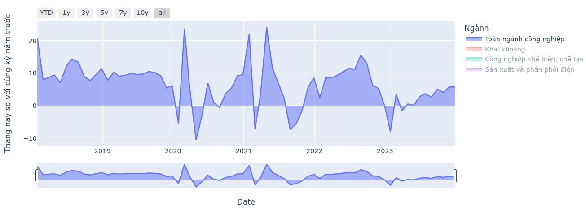
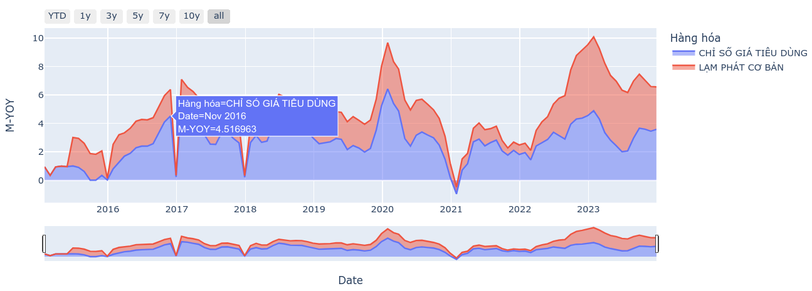
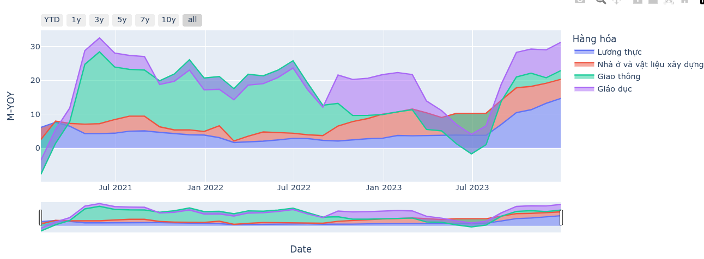
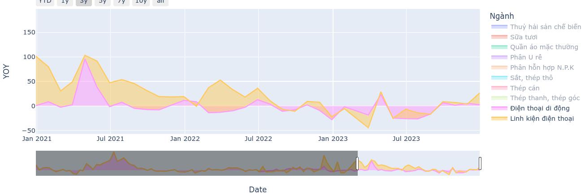
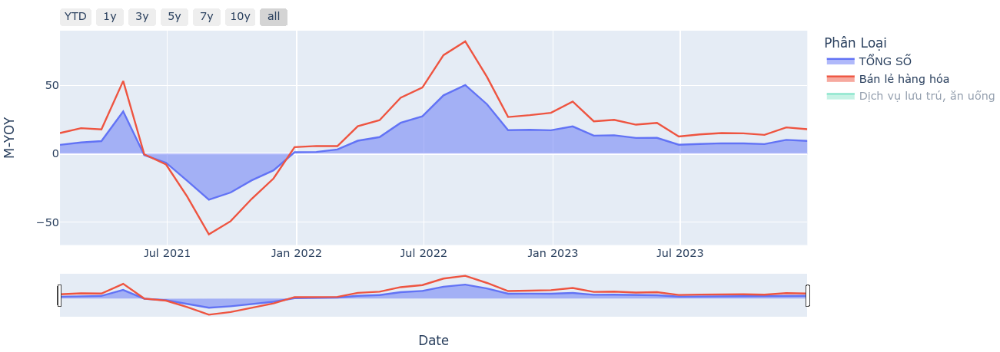
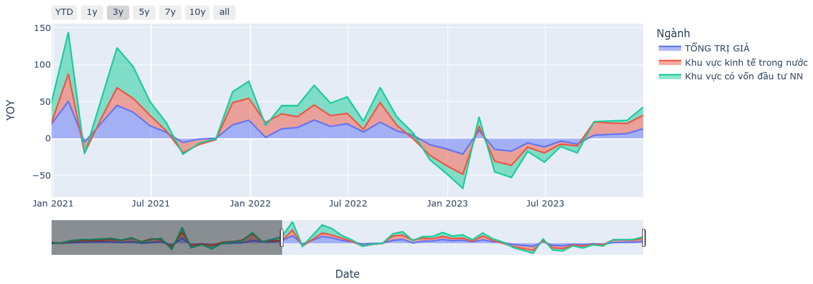

# Thống kê kinh tế vĩ mô Việt Nam

## Các chỉ số

- GDP
- IIP
- CPI
- Xuất khẩu
- Nhập khẩu
- Sản phẩm công nghiệp
- Tổng mức bán lẻ
- Vốn đầu tư thực hiện từ nguồn ngân sách nhà nước

### Ví dụ

- IIP

    

- CPI

    

    

- Sản phẩm công nghiệp

    

- Tổng mức bán lẻ

    

- Xuất khẩu

    

