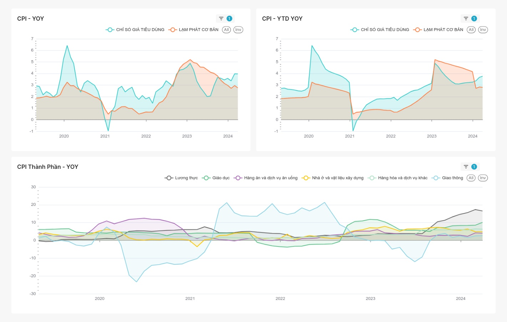
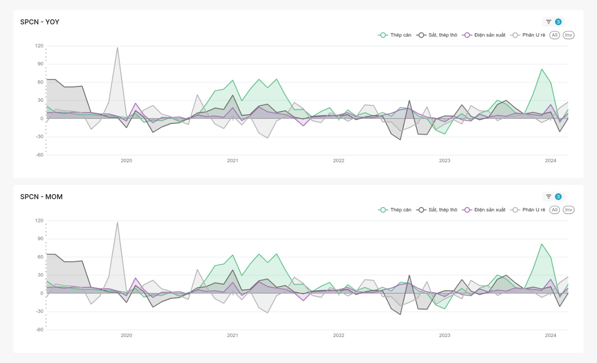

# Thống kê kinh tế vĩ mô Việt Nam và trực quan bằng superset

## Các chỉ số

- GDP
- IIP
- CPI
- Xuất khẩu
- Nhập khẩu
- Sản phẩm công nghiệp
- Tổng mức bán lẻ
- Vốn đầu tư thực hiện từ nguồn ngân sách nhà nước

## Trực quan hóa bằng superset

### Hướng dẫn sử dụng

- Chạy lệnh: `docker compose -f docker-compose.yml -f superset/docker-compose.yml up -d`
- Cập nhật ip và port của db trong file [import.ipynb](./import.ipynb)
- Chạy file [import.ipynb](./import.ipynb) để tạo dữ liệu trong db từ file csv trong thư mục [./csv](./csv/)
- Đăng nhập vào superset bằng link [localhost:10302](http://localhost:10302)
- Import superset dashboard từ file [export/dashboard_export_20240407T035748.zip](./export/dashboard_export_20240407T035748.zip)

### Một số hình ảnh

- IIP

    

- CPI

    

- Sản phẩm công nghiệp

    

- Tổng mức bán lẻ

    

- Xuất nhập khẩu

    

## Trực quan bằng seaborn

- IIP

    

- CPI

    

    

- Sản phẩm công nghiệp

    

- Tổng mức bán lẻ

    

- Xuất khẩu

    

